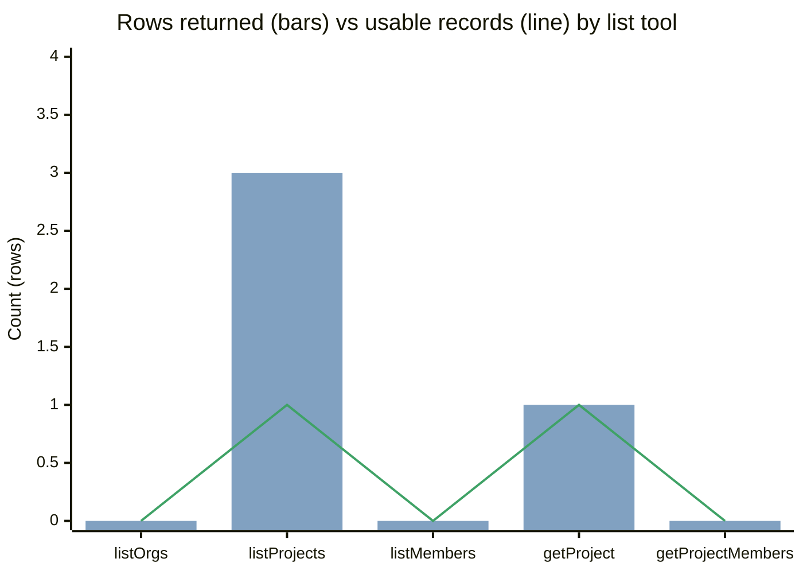
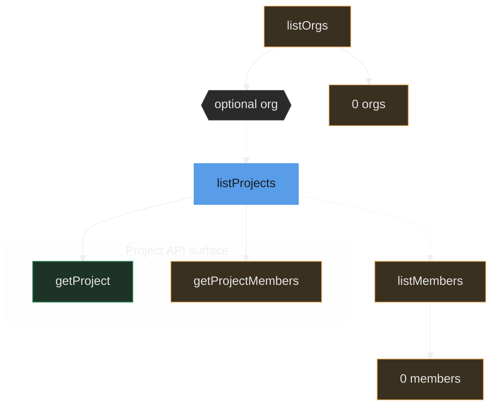
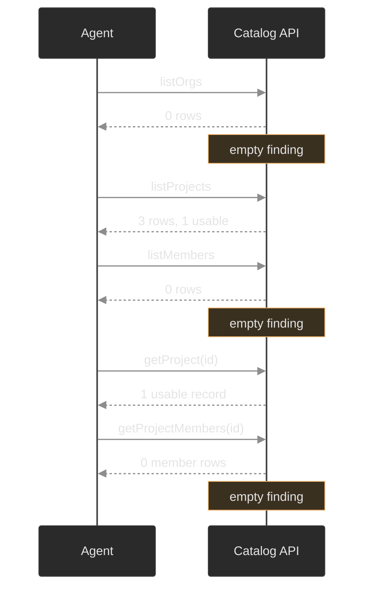
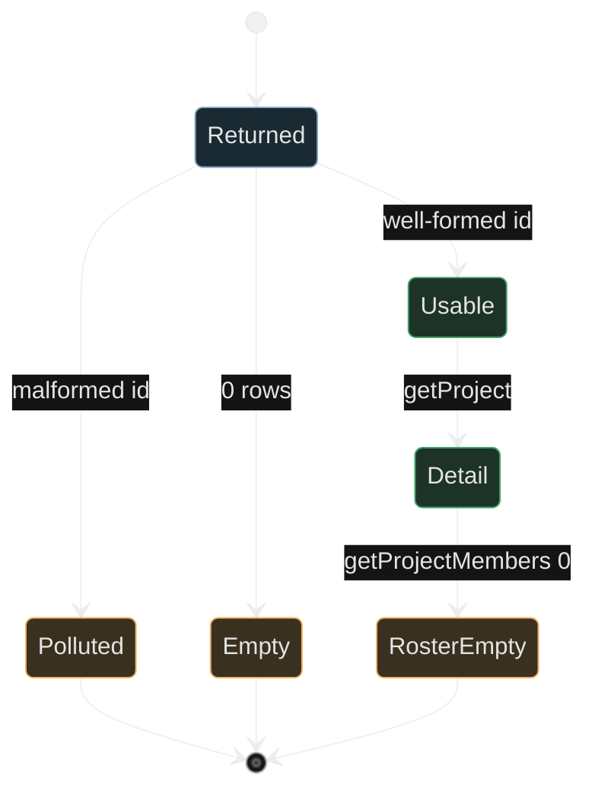
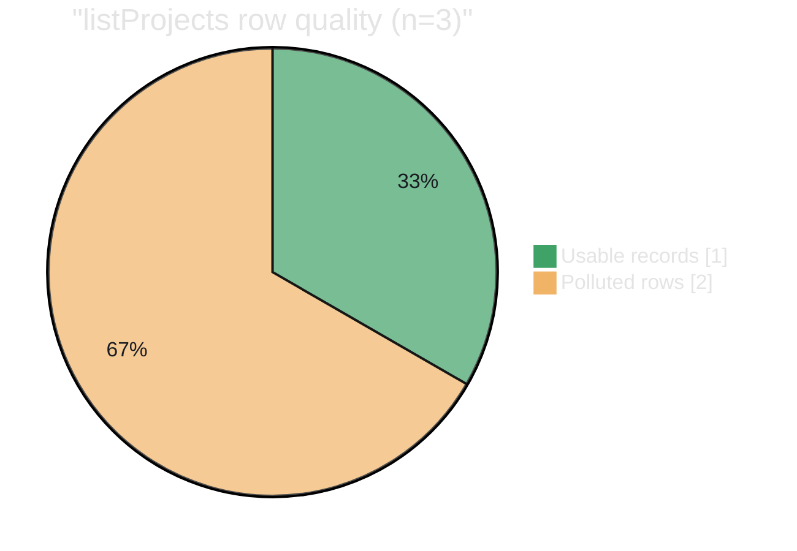

# create-mermaid

Writes Mermaid in a canvas-derived design language: one metric, named axes with units, two semantic tones, zeros kept, no rainbow / emoji / shadow / gradient.

**Rows returned** (info `#81A1C1`) · **Usable records** (success `#3FA266`) · empty finding (warning `#F1B467`)

**Usable** = well-formed id or non-empty roster. Counts are **raw rows**, not unique people.

Source: Catalog API · snapshot date

## 1. Grouped comparison

X-axis: Catalog tool · Y-axis: Count (rows)

Source: Catalog API · snapshot date · raw row counts · mermaid xychart has no series legend, so names live in the title

## 2. Discovery chain

Source: Catalog API · snapshot date · solid = required id · dashed = optional filter · **listProjects** is the focal mark

## 3. Call protocol

Source: Catalog API · snapshot date · raw row counts · optional org filter never applied (0 orgs)

## 4. Quality state of one listProjects row

Source: Catalog API · snapshot date · 3 returned rows: 1 **Usable**, 2 **Polluted**; **Empty** kept for listOrgs / listMembers

## 5. Catalog quality mix

Parts of a whole (not a grouped comparison).

Source: Catalog API · snapshot date · **Usable records** (success) · **Polluted rows** (warning) · listOrgs 0 and listMembers 0 stay off-slice as empty findings
