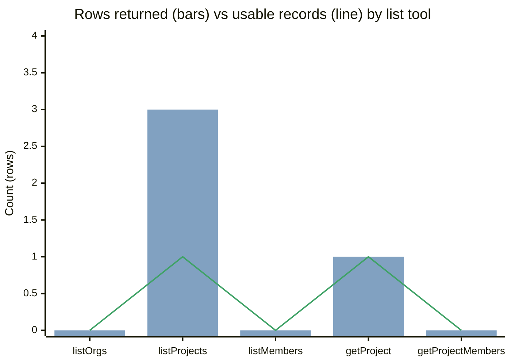
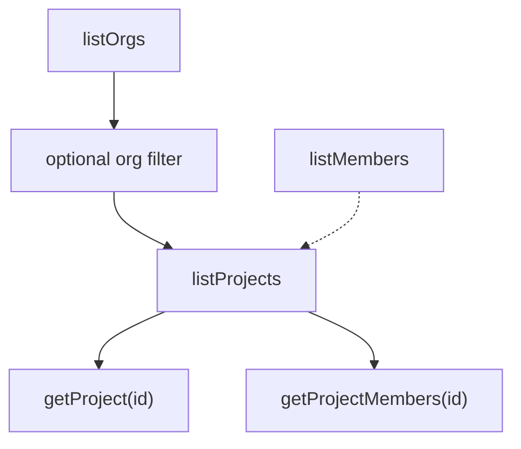
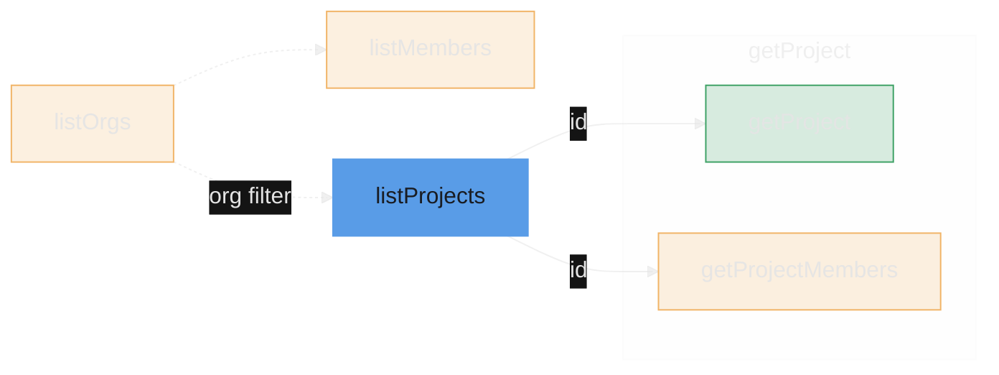
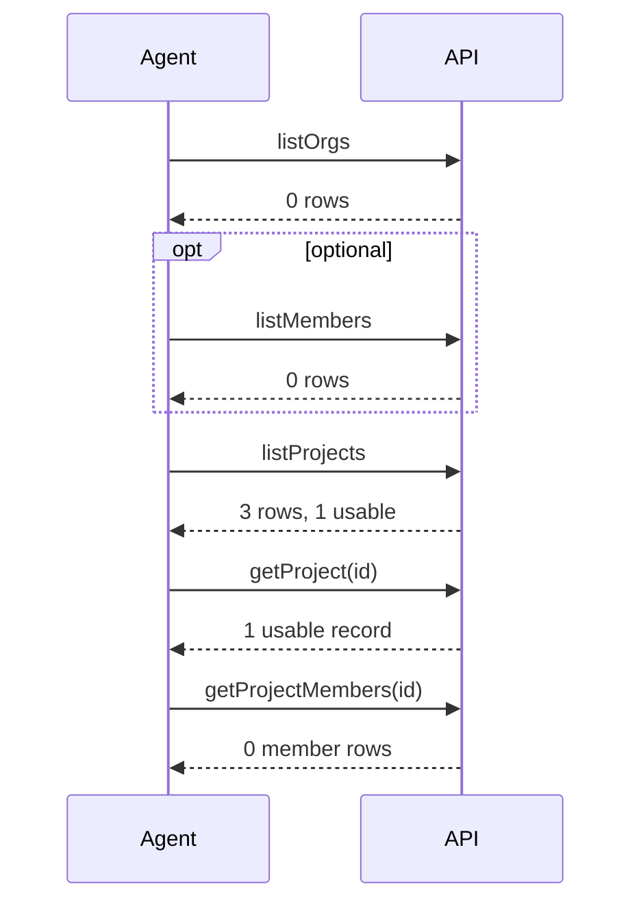
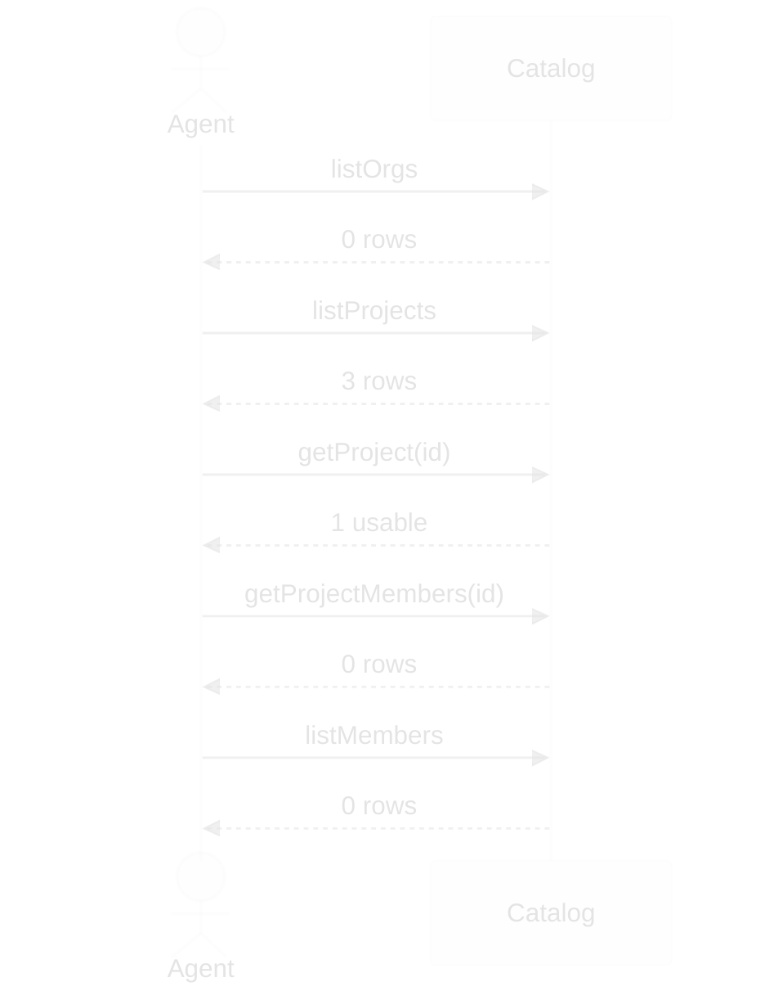
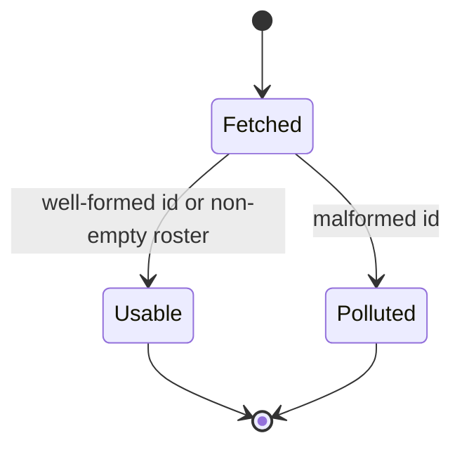
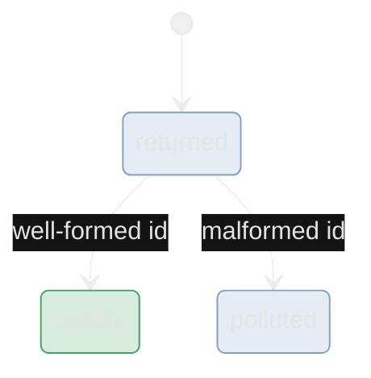
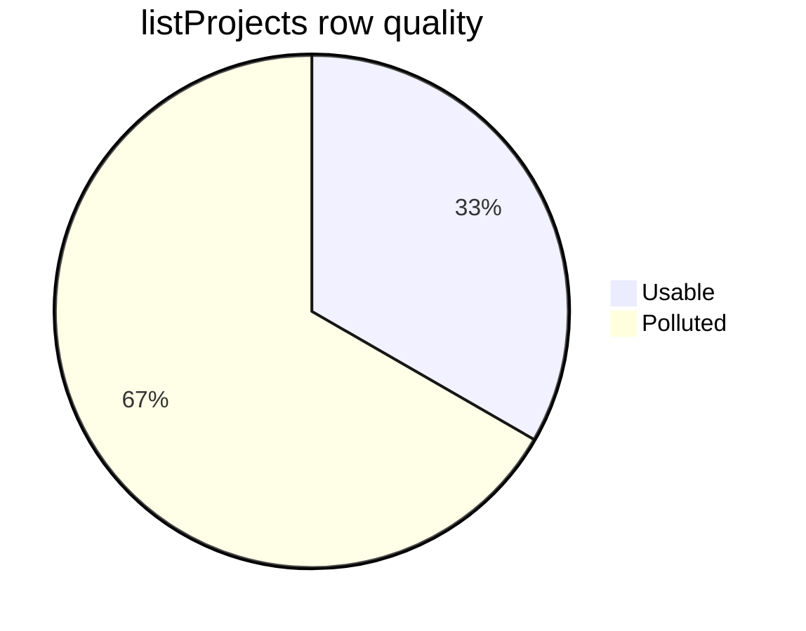

```mermaid
xychart-beta
    title "Rows returned vs usable records"
    x-axis [listOrgs, listProjects, listMembers, getProject, getProjectMembers]
    y-axis "Count" 0 --> 3
    bar [0, 3, 0, 1, 0]
    bar [0, 1, 0, 1, 0]
```

# create-mermaid

Same prompt, two agents: [without skill](7395faf1-66fc-454f-99cb-baf55d538052) vs [with skill](29cb29a1-dfe8-4c70-9683-d76c3239dd51).

**Rows returned** (info `#81A1C1`) · **Usable records** (success `#3FA266`) · empty finding (warning `#F1B467`)

**Usable** = well-formed id or non-empty roster. Counts are **raw rows**, not unique people.

## 1. Rows vs usable

<table>
<tr>
<th width="50%">Without skill</th>
<th width="50%">With skill</th>
</tr>
<tr>
<td valign="top">

</td>
<td valign="top">

Source: Catalog API · snapshot date · raw row counts · Usable = well-formed id or non-empty roster

</td>
</tr>
</table>

## 2. Discovery chain

<table>
<tr>
<th width="50%">Without skill</th>
<th width="50%">With skill</th>
</tr>
<tr>
<td valign="top">

</td>
<td valign="top">

Source: Catalog API · snapshot date · dashed = optional filter · solid = required id

</td>
</tr>
</table>

## 3. Agent API calls

<table>
<tr>
<th width="50%">Without skill</th>
<th width="50%">With skill</th>
</tr>
<tr>
<td valign="top">

</td>
<td valign="top">

Source: Catalog API · snapshot date · raw row counts · Usable = well-formed id or non-empty roster

</td>
</tr>
</table>

## 4. Row quality states

<table>
<tr>
<th width="50%">Without skill</th>
<th width="50%">With skill</th>
</tr>
<tr>
<td valign="top">

</td>
<td valign="top">

Source: Catalog API · snapshot date · one listProjects row · Usable = well-formed id

</td>
</tr>
</table>

## 5. listProjects quality mix

<table>
<tr>
<th width="50%">Without skill</th>
<th width="50%">With skill</th>
</tr>
<tr>
<td valign="top">

</td>
<td valign="top">

Source: Catalog API · snapshot date · **Usable records** (success) · **Polluted rows** (warning) · n=3

</td>
</tr>
</table>
