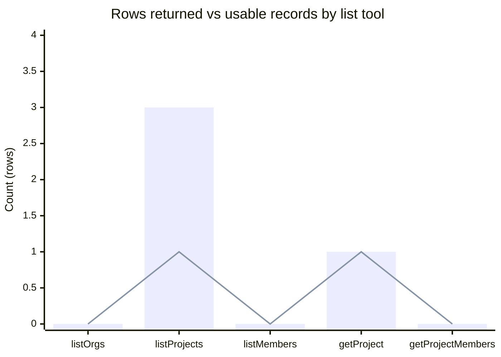
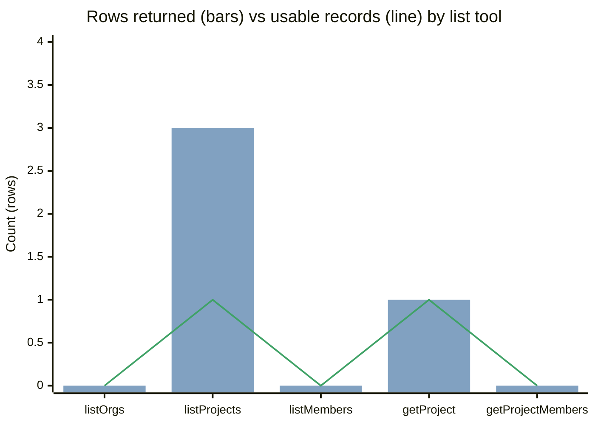
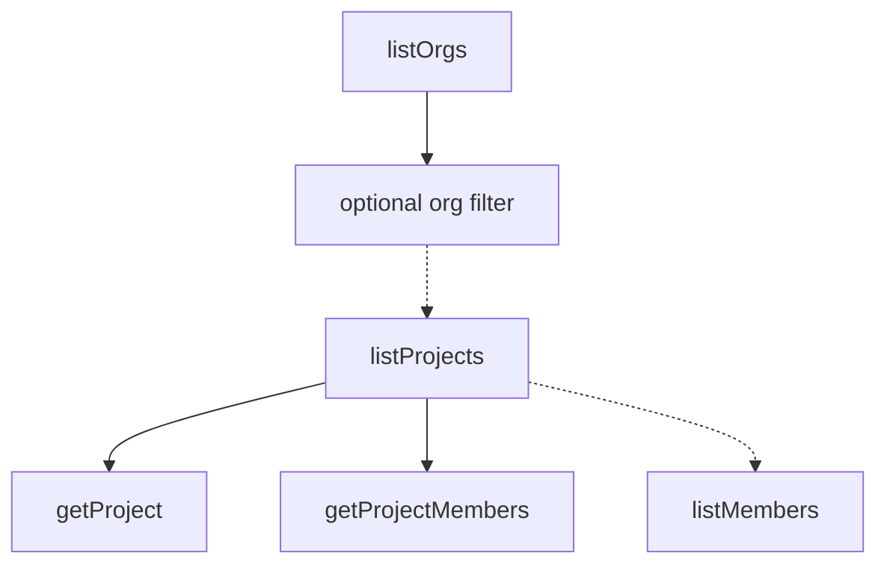
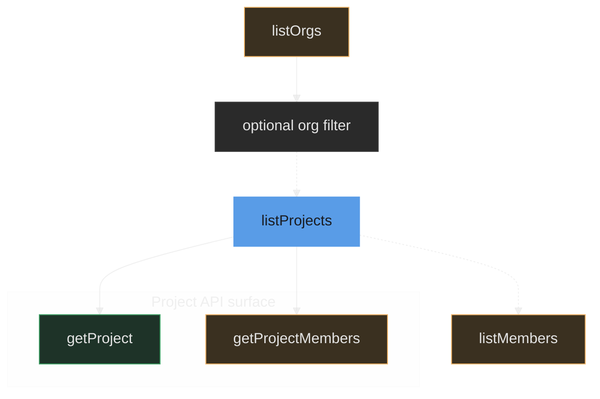
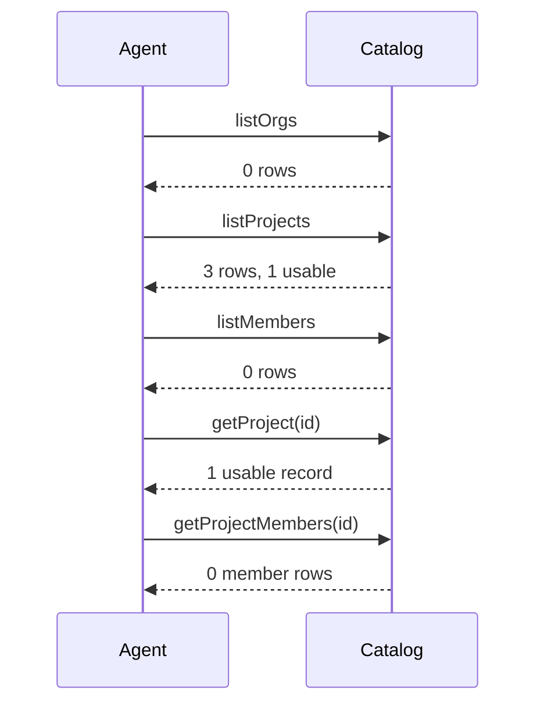
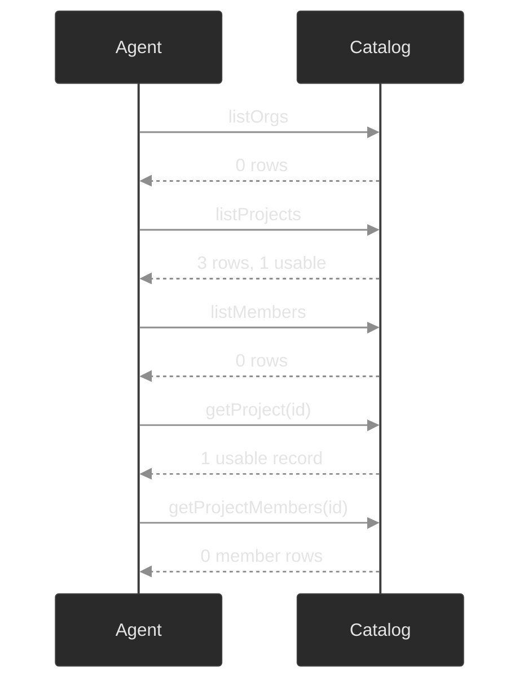
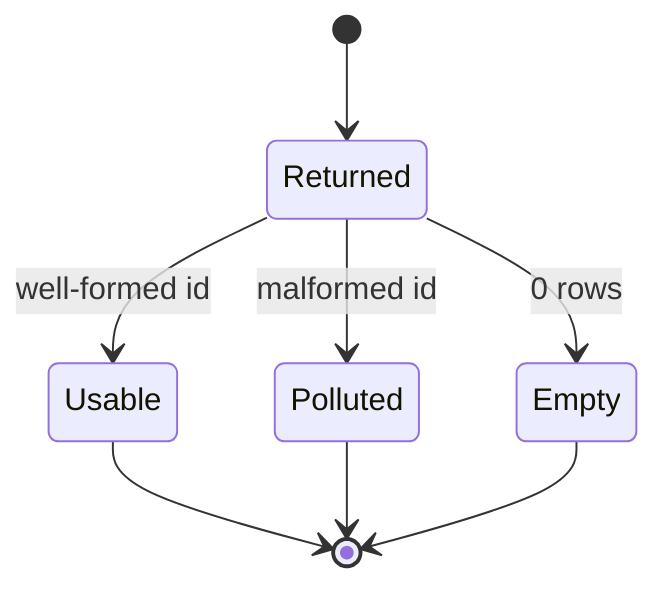
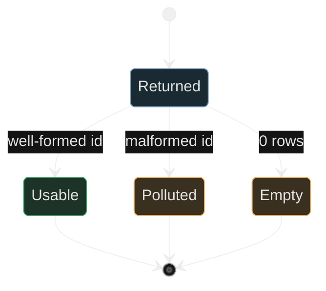
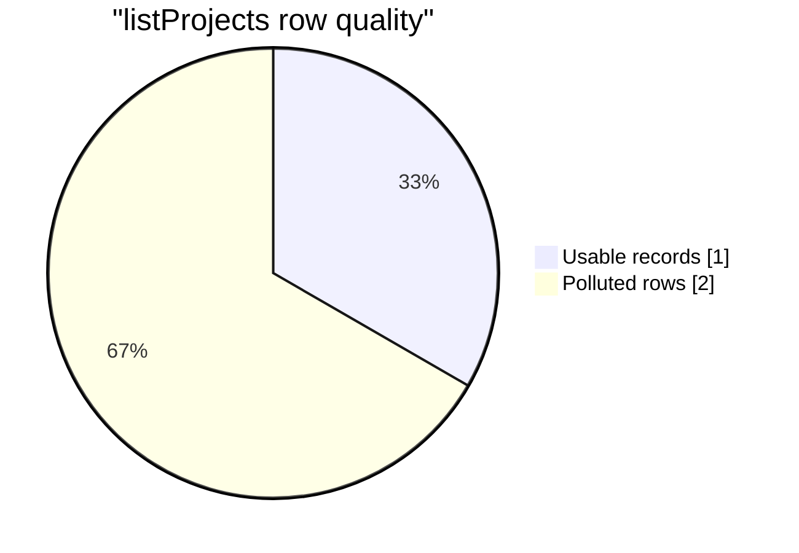

# create-mermaid

Same catalog snapshot on both sides. **Without skill** is default Mermaid. **With skill** adds the design language (theme, two tones, units, caption).

**Rows returned** (info `#81A1C1`) · **Usable records** (success `#3FA266`) · empty finding (warning `#F1B467`)

**Usable** = well-formed id or non-empty roster. Counts are **raw rows**, not unique people.

## 1. Rows vs usable

X-axis: Catalog tool · Y-axis: Count (rows) · series: **Rows returned** `[0, 3, 0, 1, 0]` · **Usable records** `[0, 1, 0, 1, 0]`

<table>
<tr>
<th width="50%">Without skill</th>
<th width="50%">With skill</th>
</tr>
<tr>
<td valign="top">

</td>
<td valign="top">

</td>
</tr>
</table>

Source: Catalog API · snapshot date · raw row counts · Usable = well-formed id or non-empty roster

## 2. Discovery chain

Nodes: `listOrgs` → `optional org filter` → `listProjects` → `getProject` / `getProjectMembers`. `listMembers` is optional from `listProjects`.

<table>
<tr>
<th width="50%">Without skill</th>
<th width="50%">With skill</th>
</tr>
<tr>
<td valign="top">

</td>
<td valign="top">

</td>
</tr>
</table>

Source: Catalog API · snapshot date · dashed = optional filter · solid = required id

## 3. Agent API calls

Same five calls, same replies, same order.

<table>
<tr>
<th width="50%">Without skill</th>
<th width="50%">With skill</th>
</tr>
<tr>
<td valign="top">

</td>
<td valign="top">

</td>
</tr>
</table>

Source: Catalog API · snapshot date · raw row counts · Usable = well-formed id or non-empty roster

## 4. Row quality states

Same states: Returned → Usable / Polluted / Empty.

<table>
<tr>
<th width="50%">Without skill</th>
<th width="50%">With skill</th>
</tr>
<tr>
<td valign="top">

</td>
<td valign="top">

</td>
</tr>
</table>

Source: Catalog API · snapshot date · one listProjects row · Usable = well-formed id

## 5. listProjects quality mix

Same slices: **Usable records** 1 · **Polluted rows** 2.

<table>
<tr>
<th width="50%">Without skill</th>
<th width="50%">With skill</th>
</tr>
<tr>
<td valign="top">

</td>
<td valign="top">

</td>
</tr>
</table>

Source: Catalog API · snapshot date · **Usable records** (success) · **Polluted rows** (warning) · n=3
