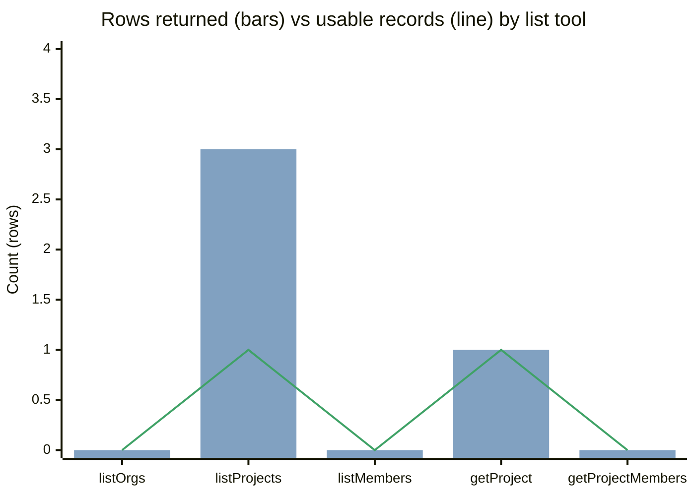

# Create Mermaid

## Source plot

- **Extracted from**: Catalog API canvas **BarChart** — *Rows returned vs usable records by list tool*.
- **Anatomy to copy**: **H2 metric title** → **axis line with units** → **grouped bars** → **legend from series names** → **source caption with transform notes**.
- **One question**: this plot asks **returned vs usable per tool**; every diagram must answer **one** question the same way.

## Plot title

- **Specific metric**: *Rows returned vs usable records by list tool* — **never** “Metrics” or “Overview”.
- **Outside the marks**: title is **H2** (18 / 24), not a decorated node or giant mermaid `title` font.
- **One title**: chat heading **or** mermaid `title` — **not both**.

## Axes

- **Name both**: **X-axis: Catalog tool** · **Y-axis: Count (rows)** — category + **unit** on the value axis.
- **Discrete X**: short **identifiers** (`listProjects`), one line, **≤5–8** categories so value labels stay readable.
- **Zero baseline**: **beginAtZero** — value axis starts at **0**, never cropped for drama.
- **Pad the max**: **yMax** just above the peak (**4** when peak is **3**) so bars do not kiss the frame.
- **Equal slots**: each category gets the **same** column — like canvas **Grid**, not a stretched leftover.

## Series

- **Two series, named exactly**: **Rows returned** (tone **info**) and **Usable records** (tone **success**).
- **Legend required**: 2+ series → legend uses those **verbatim** names.
- **Grouped, not stacked**: two measures on the **same** category sit **side by side**; stack only for **parts of a whole**.
- **No single-series rainbow**: a one-series bar chart auto-colors **each category** — **forbidden**; always pass **tone** or a second series.
- **Shared vocabulary**: series tones match **Stat / Table / Callout** — **info**, **success**, **warning**, **danger**, **neutral**.
- **Zeros stay**: a **0** bar is a **finding** (empty list); do **not** drop the category.

## Marks

- **Flat fills**: solid SVG bars — **no** area `fill`, **no** gradients, **no** shadows.
- **Value labels on**: `showValues` when categories **≤8** and series are few; omit on dense/stacked plots (tooltip only).
- **Height ~240**: plot is the **focal block**; supporting tables stay compact.
- **Reference lines**: dashed + **chip label** only for a real target/SLO; this plot has **none**.

## Color from the chart

- **Neutral majority**: axes, ticks, title, caption — **text secondary / tertiary**.
- **Two hues only**: **info** `#81A1C1` (returned) + **success** `#3FA266` (usable).
- **Warning off-plot**: empty counts live in **Stat tone="warning"** / **Callout**, not a third bar series unless the question is quality mix.
- **Accent unused on bars**: save **accent** `#599CE7` for a **single** flowchart focal node, not every column.
- **Never**: per-category rainbow, extra `classDef` hues, emoji ticks.

## Caption

- **Always**: **Source: Catalog API · snapshot date** (or equivalent source · range).
- **Transform notes**: say **raw row counts**, **not unique people**, and define **Usable**.
- **Smallest type**: **12 / 16 tertiary** — caption is not a second title.

## Type + space (from the plot chrome)

- **H1 once** on the page; **H2** is the **plot title**.
- **Axis annotation**: **small secondary** above the marks.
- **Gaps**: **8** inside the plot stack, **16** in the stats grid, **20** page — mermaid rank spacing should feel the same.
- **Identifiers**: tool names as **plain slugs** in axes/nodes; **Code** only in surrounding prose.

## Mermaid xychart (canonical)

- **Use `xychart-beta`** when the canvas question is **numeric comparison**.
- **Map 1:1**: title → metric H2; `x-axis` → tool categories; `y-axis "Count (rows)" 0 --> 4`.
- **Two named series**: mermaid xychart cannot group two named bars — use **bar** for **Rows returned** and **line** for **Usable records**, and put those names in the **title**.
- **Theme**: **base** only; **primaryColor** editor, **primaryTextColor** text.primary, **lineColor** text.secondary — **no** dark-bar-on-dark that hides zeros.
- **plotColorPalette**: `#81A1C1, #3FA266`

- **Caption under that diagram**: **Source: Catalog API · snapshot date · raw row counts · Usable = well-formed id or non-empty roster**
- **Legend in prose** if mermaid omits it: **Rows returned** (info) · **Usable records** (success)

## Flowcharts from the same language

- **Categories → nodes**: one node per **x-axis tool**, short slug labels.
- **Series → classDef**: **info** = returned-but-untrusted; **success** = usable; **warning** = empty **finding** (the 0s), not a missing node.
- **TB** = value comparison / hierarchy (canvas **Stack**); **LR** = pipeline (canvas **Row**).
- **One subgraph card**: wrap the **get*** pair as the named API unit; leave **list*** on the open plot.
- **Solid vs dashed**: **solid** = required id; **dashed** = optional filter.
- **Focal mark**: at most **one** **primary** fill (`#599CE7` / `#191c22` on-accent), equivalent to the **tallest meaningful bar** (`listProjects`).
- **No essay nodes**: if it needed the chart caption, it stays in the **caption**.

## classDef (chart tones)

- **info**: `fill:#81A1C133,stroke:#81A1C1,color:#E4E4E4EB` — **Rows returned**
- **success**: `fill:#3FA26633,stroke:#3FA266,color:#E4E4E4EB` — **Usable records**
- **warning**: `fill:#F1B46733,stroke:#F1B467,color:#E4E4E4EB` — empty **finding**
- **neutral**: `fill:#E4E4E411,stroke:#E4E4E414,color:#E4E4E4EB` — axes / supporting nodes
- **primary**: `fill:#599CE7,stroke:#599CE7,color:#191c22` — **one** focal node
- **Light theme**: text `#141414`, fill `#FCFCFC`, accent `#3685BF`, success `#1F8A65`

## Type limits

- **Do not use sankey**: it forces **gradients** and a rainbow palette.
- **ER / requirement**: often **monochrome** — put counts in fields, not extra hues.
- **Quadrant**: all points share one fill — keep **one** outlier as the story.
- **xychart**: no series legend — encode names in the **title**.

## Anti-patterns (from the plot rules)

- **Unlabeled axes**: a mermaid chart without **unit** on Y is unfinished.
- **Rainbow columns**: default single-series palette — **retone** or add a **second** series.
- **Stacked comparison**: stacking **returned + usable** would **double-count**; those series are **grouped**.
- **Dropping zeros**: hiding `listOrgs` because it is 0 **lies**; keep the category.
- **Area fill / line glow**: LineChart `fill` is a **soft tint** we did **not** use — mermaid must stay **flat bars or hairline edges**.
- **Emoji / shadows / gradients**: **zero**.

## Pre-delivery check

- **Squint**: the **plot** (or its mermaid twin) is the one thing that stands out.
- **Self-describing**: title + **both axes + units** + **legend** + **source/date** readable with no chat context.
- **Two tones**: **info** and **success** on the marks; **warning** only for empty findings.
- **Zeros plotted**: empty tools still occupy an **x** slot.
- **Slop scan**: rainbow, gradients, emojis, shadows, giant title — **none**.
