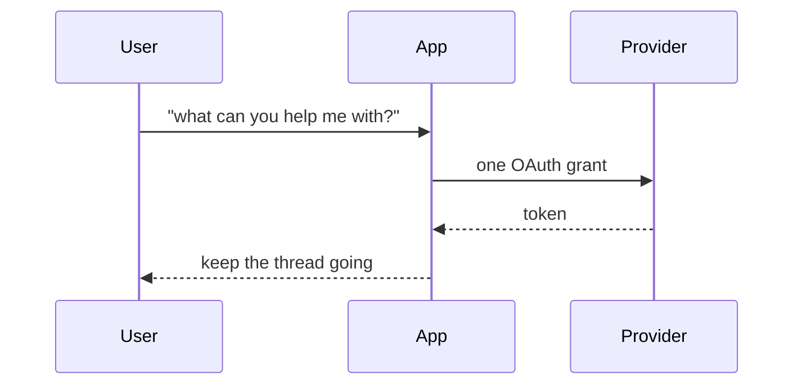
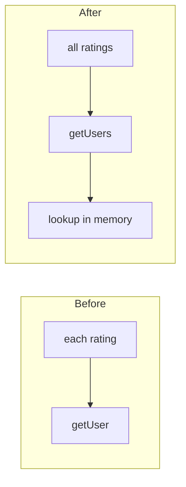
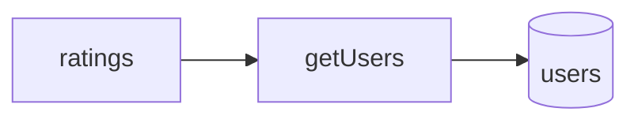

# File PR

Before filing, check whether a PR for this branch already exists. Review the diff locally against `origin/main` to make sure its contents match the goal.

```bash
gh pr list --head "$(git branch --show-current)"
git diff origin/main...HEAD
```

## Title

- Use conventional commit messages (`feat:`, `fix:`, `docs:`, `chore:`), lowercase, imperative.
- Prefer a concise, human-readable title that explains why the change matters.

❌ BAD
> `perf(server): negotiate permessage-deflate on the websocket`

✅ GOOD
> `perf(server): cut websocket frame size by 70%+ with gzipping`

## Description

**1. Problem → Solution**

Open with a simple explanation of the problem based on the user's original prompt, then briefly explain the solution.

❌ BAD

> Unified the analytics client onto the shared OAuth connector uid and scope list from `lib/oauth-scopes.ts`. Upgraded the agent runtime 0.22.6 → 0.33.3 so targeted connection lookups no longer replay unrelated authorization callbacks, and bumped the connect SDK 0.3.2 → 0.8.0 for the peer requirement.

✅ GOOD

> Asking the assistant "what can you help me with?" fired 12 sign-in prompts and the thread died.
>
> - One grant now covers every connection behind the same provider
> - Sessions keep going while a sign-in is open

**2. Technical Details**

If the change is technical, use simple code examples to explain the change.

❌ BAD

> Reworked the ratings fetch to remove the N+1 query pattern by collecting all the user IDs up front, issuing a single batched `IN` query against the users table, and then hydrating each rating with its author via an in-memory lookup map keyed by user ID instead of querying per row inside the loop.

✅ GOOD

> We were hitting the DB once per rating to load its author. Now it's one query:
>
> ```ts
> // before: one query per rating
> for (const r of ratings) {
>   r.author = await getUser(r.userId);
> }
>
> // after: one query, then look up in memory
> const users = await getUsers(ratings.map((r) => r.userId));
> ratings.forEach((r) => (r.author = users[r.userId]));
> ```

**3. Visual**

- Include a mermaid diagram that shows what changed
- Pick the smallest view that makes the key point clear
- Keep only the calls, files, and boundaries a reviewer needs
- Place it next to the short text it supports.
- If you use before vs after, put them next to each other (gird 2 columns)

Match the diagram to the change:

- sequence for interaction or data flow
- flowchart for a control-path change
- graph for module, ownership, or file-boundary change

When the surrounding shape already exists, show before vs after rather than only the new state. Skip the diagram only for tiny docs or chore PRs with no flow, structure, or control-path shift.

❌ BAD

> No diagram for a flow change, or a dump of the whole system with nodes the PR never touches.

✅ GOOD — sequence (interaction / data flow)



✅ GOOD — before vs after (control path)



✅ GOOD — graph (module / file boundary)



## Proof

If helpful, provide screenshots, videos, or other evidence of the change.

## Open it

Open a real PR, not a draft, so review bots run.

```bash
gh pr create --base main --title "<title>" --body "<body>"
```
